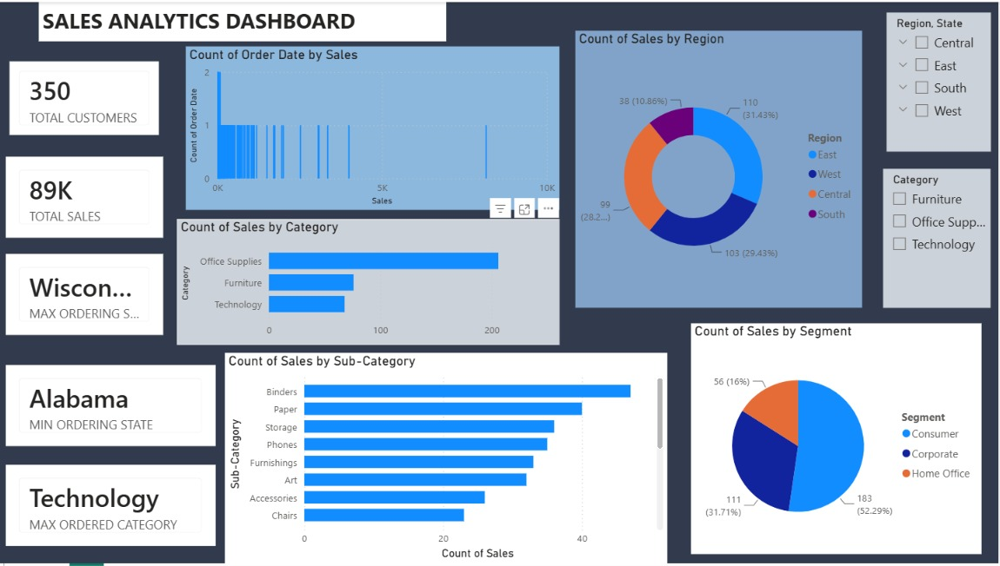

📊 Sales Analysis Dashboard | Power BI

 📌 Project Overview

This is my first Power BI dashboard project, created to practice **data analysis, data cleaning, and data visualization** using Power BI.

The dashboard provides an interactive view of sales data and helps present key information through visual reports and charts.

🛠️ Tools & Technologies

* Power BI
* Power Query
* DAX
* Excel
* Data Visualization

📊 Dashboard

The dashboard includes interactive visualizations to explore sales performance and identify patterns and trends in the data.

Dashboard Preview

🔍 Key Features

* Interactive Power BI dashboard
* Sales performance visualization
* KPI cards
* Charts and graphs for data analysis
* Interactive filters and slicers
* Data cleaning and transformation using Power Query
* Basic DAX calculations

📈 Analysis Performed

The project focuses on exploring the dataset to understand:

* Sales performance
* Trends and patterns
* Category-wise performance
* Regional performance
* Key business metrics

 Key Learnings

Through this project, I learned how to:

* Import and transform data using Power Query
* Clean and prepare data for analysis
* Create relationships and measures in Power BI
* Build interactive dashboards
* Use charts and visualizations effectively
* Present data in a simple and understandable way

📁 Project Files

* `PROJECT2.pbix` — Power BI dashboard file
* `dashboard_screenshot.png.jpeg` — Dashboard preview

Future Improvements

I plan to improve this project by adding:

* More advanced DAX measures
* Additional business KPIs
* Advanced data analysis
* Improved dashboard design
* More detailed business insights

 Author

Anubhav

Aspiring Data Analyst

Skills: Python | SQL | Power BI | Data Visualization | EDA | Excel

This project is part of my journey toward becoming a Data Analyst.
